**مشروع:** إدارة البئر والسقي
**حالة الوثيقة:** مرجعية منقّحة — الإصدار 2.0
**تاريخ التنقيح:** 2026-08-12
**مصدر التنقيح:** 47 قرارًا موثّقًا في `memory/DECISIONS.md`

> ⚠️ **اقرأ هذا أولًا**
>
> هذه الوثيقة جزء من أربع وثائق كانت مدموجة في ملف واحد، وقد فُصلت.
>
> عند أي تعارض بين هذه الوثيقة وملف `memory/DECISIONS.md`، **سجل القرارات هو الحاكم**.
>
> المقاطع المعلّمة بـ ❌ ملغاة ولا يجوز البناء عليها.
> المقاطع المعلّمة بـ ➕ مضافة بقرار لاحق.

---
### الأقسام المعدّلة في هذه الوثيقة

* **قاموس الاشتراكات** — التسمية المعتمدة `billing.*` لا `core.*` (ق-26).
* **تقريب المدة** وما يتبعه — ❌ ملغى (ق-12).
* **مصفوفة مصدر الحقيقة** — حلّ محلها `PROJECT_MAP.md`.
* **القواعد المعتمدة للحساب** — حلّ محلها `technical/INVARIANTS.md`.
* **وقت تنبيه نهاية الجلسة** — صار إشعارًا محليًا لا مدفوعًا (ق-35).

---

# مخطط العلاقات ERD وقاموس البيانات الأساسي لمنصة إدارة الآبار

**الإصدار:** 1.0
**الحالة:** مرجع معماري قبل إنشاء ملفات PostgreSQL Migrations
**النطاق:** قاعدة البيانات المركزية، بيانات الهاتف المحلية، العلاقات، حالات السجلات، ومصادر الحقيقة
**قاعدة البيانات المركزية:** PostgreSQL
**قاعدة الهاتف:** SQLite متزامنة عبر PowerSync
**العملة الأولى:** `YER`
**المنطقة الزمنية الافتراضية:** `Asia/Aden`
**قاعدة الأرقام:** الأرقام الإنجليزية `0–9` في جميع اللغات

---

# 1. الهدف من هذه الوثيقة

تحول هذه الوثيقة المتطلبات السابقة إلى خريطة واضحة تبين:

* ما الكيانات التي سيحفظها النظام.
* كيف ترتبط الجداول ببعضها.
* أين تحفظ معلومات المزارع وأراضيه.
* كيف يرتبط الشريك بالبئر.
* كيف تنتقل جلسة السقي من حجز إلى فاتورة.
* كيف ترتبط الدفعات والديون بالصندوق.
* كيف يسجل الديزل الخاص بالبئر والديزل الخاص بالمزارع.
* ما البيانات التي تنزل إلى هاتف المشغل.
* ما البيانات التي تبقى مركزية وحساسة.
* ما السجل الذي يعتبر المصدر الرسمي لكل رقم.

النظام يجب أن يدعم التشغيل بالطاقة الشمسية والديزل أو الجمع بينهما، مع وجود عدة ملاك ومشغلين ومزارعين. كما يجب أن يخدم المشغل في الميدان ويمنح المالك تقارير مالية ورقابية من البيانات نفسها.

---

# 2. مفهوم الكيان والعلاقة بصورة مبسطة

## 2.1 ما هو الكيان؟

الكيان هو شيء مهم يحتاج التطبيق إلى حفظ بياناته.

أمثلة:

* شخص.
* مزارع.
* بئر.
* أرض.
* جلسة سقي.
* فاتورة.
* دفعة.
* مصروف.

## 2.2 ما هي العلاقة؟

العلاقة توضح كيف يرتبط شيء بشيء آخر.

مثال:

```text
مزارع واحد
يمتلك أو يستخدم
عدة أراضٍ
```

ومثال آخر:

```text
بئر واحد
يحتوي على
عدة جلسات سقي
```

## 2.3 معاني العلاقات

### واحد إلى واحد `1:1`

مثل:

```text
بئر واحد
له
سجل إعدادات رئيسي واحد
```

### واحد إلى عدة `1:N`

مثل:

```text
مزارع واحد
له
عدة جلسات سقي
```

### عدة إلى عدة `N:M`

مثل:

```text
الشخص الواحد قد يرتبط بعدة آبار
والبئر الواحد يحتوي على عدة أشخاص
```

تحتاج العلاقة المتعددة إلى جدول وسيط يوضح دور الشخص في كل بئر.

---

# 3. المخطط العام للمنصة

```text
المنصة
└── العميل أو المؤسسة Tenant
    ├── الاشتراك والخطة
    ├── الأشخاص والمستخدمون
    ├── بئر 1
    │   ├── الشركاء
    │   ├── المشغلون
    │   ├── المزارعون
    │   ├── الأراضي
    │   ├── المضخات والخطوط
    │   ├── الحجوزات
    │   ├── جلسات السقي
    │   ├── الفواتير والدفعات
    │   ├── الصناديق
    │   ├── الديزل
    │   ├── المصروفات
    │   └── الأرباح والتقارير
    └── بئر 2 أو أكثر
```

---

# 4. مخطط الهوية والعملاء

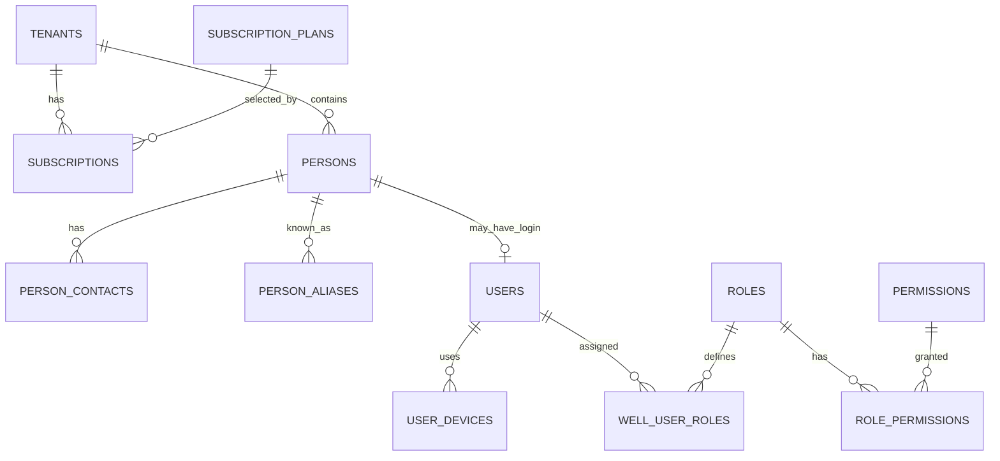

## ما يعنيه المخطط

* كل عميل يملك حسابًا مستقلًا.
* العميل قد يكون في فترة تجريبية أو خطة مدفوعة.
* كل شخص يسجل مرة واحدة فقط داخل حساب العميل.
* الشخص قد يكون مزارعًا وشريكًا ومشغلًا في الوقت نفسه.
* حساب الدخول منفصل عن بطاقة الشخص.
* المزارع في النسخة الأولى يملك بطاقة شخص، لكنه لا يحتاج حساب دخول.
* الصلاحيات ترتبط بالمستخدم والبئر والدور.

---

# 5. مخطط الآبار والأشخاص

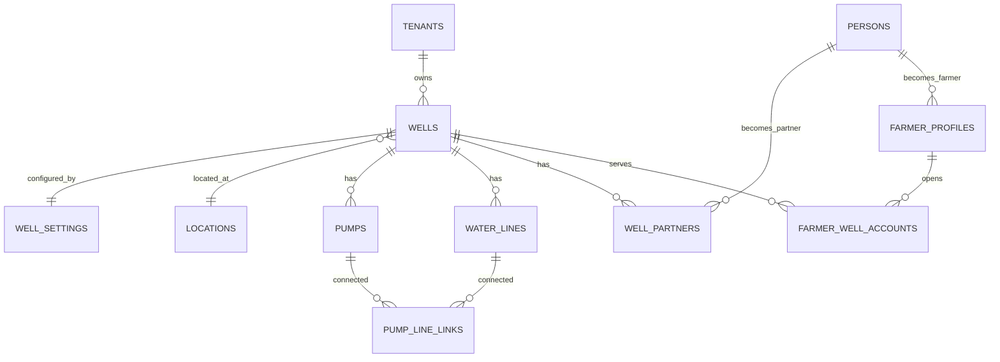

## ما يعنيه المخطط

الشخص الواحد يمكن أن يكون:

```text
شريكًا في بئر الوادي
+
مزارعًا في البئر نفسه
+
مديرًا في بئر آخر
```

ولا نكرر اسمه أو رقم هاتفه في سجلات منفصلة.

---

# 6. مخطط المزارعين والأراضي

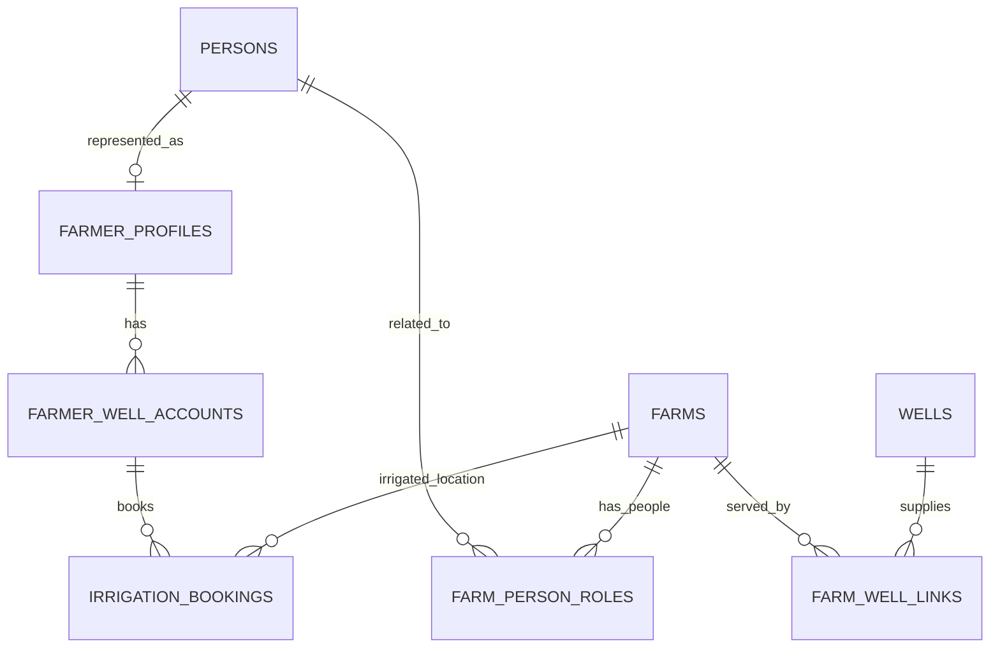

## لماذا لم نربط الأرض مباشرة بحقل `farmer_id`؟

لأن الواقع قد يحتوي على حالات مثل:

* شخص يملك الأرض.
* شخص آخر يستأجرها.
* شخص ثالث يديرها.
* المزارع يسقي أرضًا ليست مسجلة باسمه ملكيةً.

لذلك نستخدم جدول علاقة يوضح:

```text
الشخص ← نوع علاقته بالأرض ← الأرض
```

أنواع العلاقة:

* مالك.
* مستأجر.
* مدير.
* مستفيد.
* علاقة أخرى.

---

# 7. مخطط الشركاء والملكية

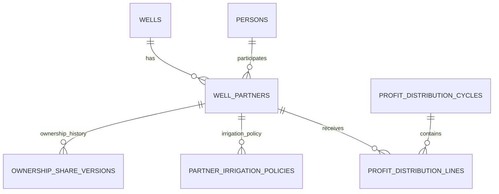

## الفكرة الأساسية

لا نحفظ نسبة الشريك داخل سجل واحد متغير.

بل نحفظ تاريخ النسب:

```text
أحمد
01/01/2026 إلى 30/06/2026 = 25%

أحمد
ابتداءً من 01/07/2026 = 30%
```

وهكذا تبقى الحسابات القديمة صحيحة.

---

# 8. مخطط التشغيل والحجوزات

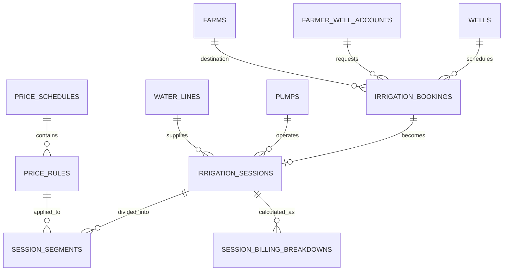

## رحلة البيانات

```text
حجز
↓
بدء جلسة
↓
مقاطع تشغيل وتوقف
↓
حساب مدة كل مصدر
↓
تقريب المدة
↓
تطبيق الأسعار
↓
إنشاء فاتورة
```

---

# 9. مخطط الفواتير والدفعات

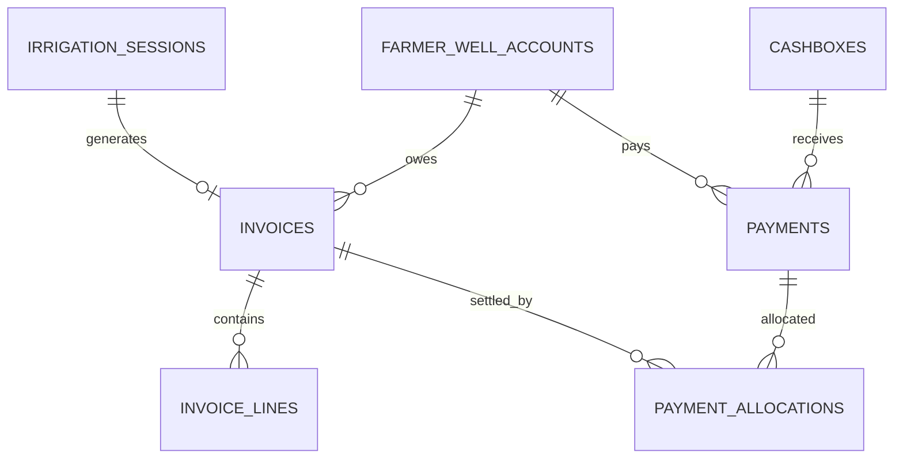

## سبب فصل الفاتورة عن الدفعة

الفاتورة تقول:

> كم يجب على المزارع أن يدفع؟

أما الدفعة فتقول:

> كم دفع فعليًا؟

مثال:

```text
الفاتورة: 20,000 ريال
الدفعة الأولى: 8,000 ريال
الدفعة الثانية: 5,000 ريال
المتبقي: 7,000 ريال
```

لو تم دمج الفاتورة والدفعة في سجل واحد فلن نستطيع تمثيل الدفع الجزئي بصورة صحيحة.

---

# 10. مخطط المحرك المالي

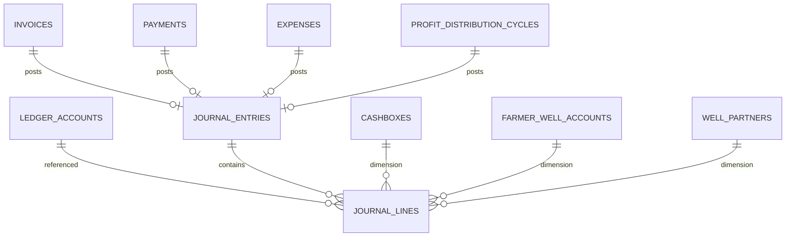

## القاعدة الأساسية

كل حركة مالية تنشئ قيدًا متوازنًا:

```text
مجموع الطرف المدين
=
مجموع الطرف الدائن
```

المستخدم لن يرى التعقيد المحاسبي، لكن النظام يستخدمه لضمان سلامة الأموال.

---

# 11. مخطط الديزل والمخزون

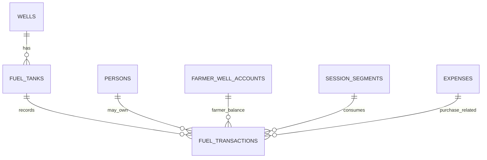

## نوعا ملكية الديزل

```text
ديزل ملك البئر
أو
ديزل ملك المزارع
```

لا يسمح النظام باستخدام ديزل مزارع لمزارع آخر.

---

# 12. مخطط المصروفات والنوبات

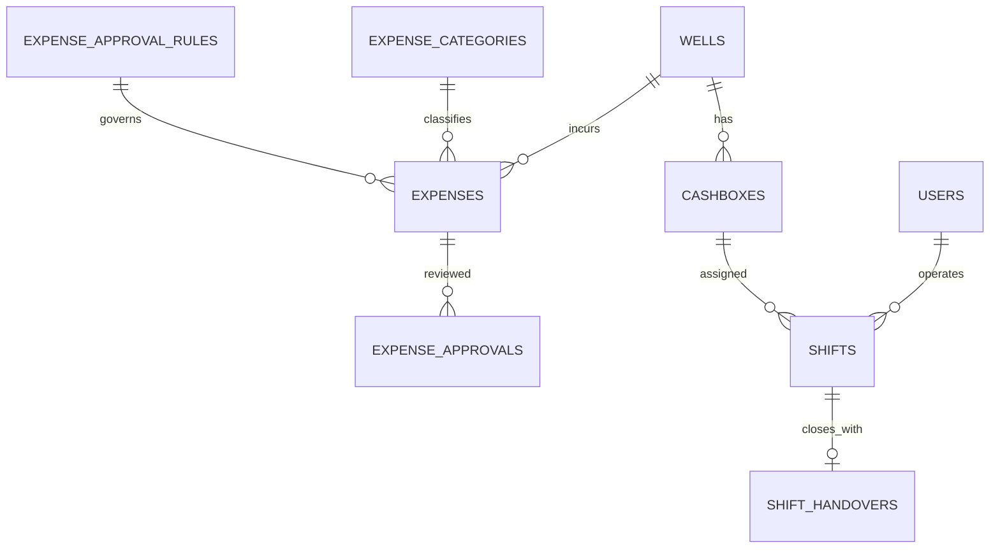

---

# 13. مخطط الإقفال والتوزيع

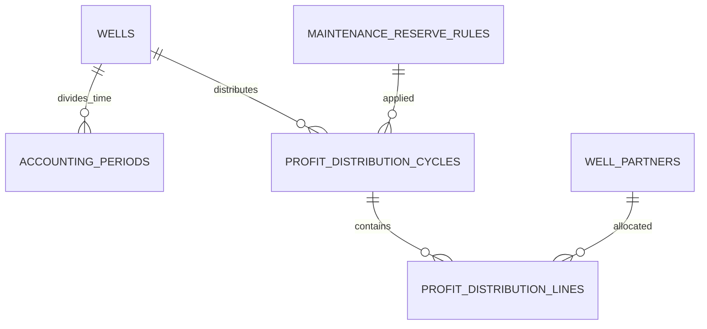

---

# 14. مخطط التدقيق والمزامنة

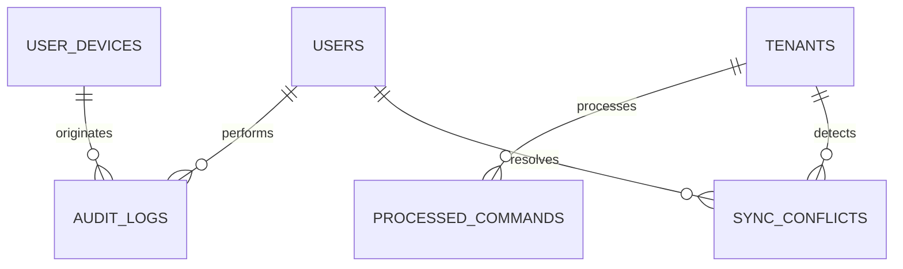

---

# 15. طبقات مصدر الحقيقة

لا تحمل جميع الجداول الدرجة نفسها من الأهمية.

## 15.1 مصادر الحقيقة الرئيسية

هذه الجداول هي المرجع النهائي:

* الأشخاص.
* الآبار.
* نسب الشركاء التاريخية.
* جلسات السقي ومقاطعها.
* حركات الوقود.
* الفواتير.
* الدفعات.
* القيود اليومية.
* المصروفات المعتمدة.
* دورات توزيع الأرباح.
* سجل التدقيق.

## 15.2 جداول ملخصات محسوبة

مثل:

* رصيد المزارع.
* رصيد الصندوق.
* رصيد الوقود.
* رصيد الشريك.
* التقرير اليومي.

هذه لا تعتبر المصدر النهائي، بل نتائج محسوبة من العمليات الأصلية.

## 15.3 بيانات مؤقتة

مثل:

* مسودة حجز.
* فاتورة مسودة.
* مصروف ينتظر الاعتماد.
* صورة تنتظر الرفع.
* أمر مزامنة ينتظر الإرسال.

---

# 16. قاموس البيانات: العملاء والاشتراكات

## 16.1 جدول `core.tenants`

### الغرض

يمثل العميل التجاري الذي يستخدم المنصة.

قد يكون:

* مالك بئر واحد.
* مؤسسة تدير عدة آبار.
* مجموعة شركاء.
* عميل تجريبي.

### أهم الحقول

| الحقل              | المعنى            | إلزامي |
| ------------------ | ----------------- | -----: |
| `id`               | المعرف الثابت     |    نعم |
| `public_code`      | رمز ظاهر للعميل   |    نعم |
| `name`             | اسم العميل        |    نعم |
| `legal_name`       | الاسم القانوني    |     لا |
| `status`           | حالة الحساب       |    نعم |
| `default_currency` | العملة الافتراضية |    نعم |
| `default_timezone` | التوقيت الافتراضي |    نعم |
| `trial_started_at` | بداية التجربة     |     لا |
| `trial_ends_at`    | نهاية التجربة     |     لا |

### حالات العميل

* `trial`
* `active`
* `past_due`
* `suspended`
* `cancelled`
* `archived`

### هل ينزل إلى الهاتف؟

ينزل منه فقط:

* اسم العميل.
* حالته.
* الخطة.
* الحدود المؤثرة في الاستخدام.

---

## 16.2 جدول `core.subscription_plans`

### الغرض

تعريف الخطط التجارية.

### أمثلة

```text
تجريبية
أساسية
متقدمة
مؤسسات
```

### أهم الحقول

* عدد الآبار.
* عدد المستخدمين.
* مساحة التخزين.
* السعر الشهري.
* السعر السنوي.
* الخصائص المتاحة.

### هل ينزل إلى الهاتف؟

تنزل فقط معلومات الخطة اللازمة لعرض حالة الاشتراك.

---

## 16.3 جدول `core.subscriptions`

### الغرض

تسجيل اشتراك العميل الحالي وتاريخه.

### مصادر الاشتراك

* Google Play.
* اشتراك يدوي.
* رمز تفعيل.
* موزع.
* فاتورة مباشرة.

### مصدر الحقيقة

الخادم فقط.

لا يسمح للهاتف بتغيير حالة الاشتراك.

---

# 17. قاموس البيانات: الأشخاص والهوية

## 17.1 جدول `core.persons`

### الغرض

بطاقة الشخص الموحدة.

### الشخص قد يكون

* مزارعًا.
* شريكًا.
* مشغلًا.
* مديرًا.
* محاسبًا.
* دافعًا نيابة عن مزارع.

### أهم الحقول

| الحقل                   | المعنى                  |
| ----------------------- | ----------------------- |
| `id`                    | المعرف الثابت           |
| `public_code`           | رمز ظاهر                |
| `full_name`             | الاسم الكامل            |
| `normalized_name`       | نسخة مخصصة للبحث        |
| `preferred_name`        | الاسم المفضل            |
| `father_name`           | اسم الأب                |
| `family_name`           | اسم الأسرة              |
| `nickname`              | اللقب                   |
| `status`                | حالة السجل              |
| `merged_into_person_id` | الشخص الأساسي بعد الدمج |

### قابلية التعديل

يمكن تعديل:

* الاسم.
* الهاتف.
* الملاحظات.

لكن لا يتغير `id`.

### هل ينزل إلى الهاتف؟

تنزل بطاقات الأشخاص المرتبطين بالآبار المسموح للمستخدم بها.

---

## 17.2 جدول `core.person_contacts`

### الغرض

حفظ أكثر من وسيلة تواصل للشخص.

### أمثلة

```text
رقم المزارع نفسه
رقم ابنه
رقم واتساب
رقم احتياطي
```

### حقول مهمة

* نوع الاتصال.
* القيمة الأصلية.
* القيمة الموحدة للبحث.
* هل الرقم أساسي؟
* هل يخص الشخص نفسه؟
* اسم مالك الرقم عند كونه رقم قريب.

### قاعدة مهمة

رقم الهاتف ليس فريدًا إجباريًا.

يظهر تنبيه إذا استخدم الرقم نفسه لعدة أشخاص، لكن لا يمنع الحفظ.

---

## 17.3 جدول `core.person_aliases`

### الغرض

حفظ الأسماء التي يُعرف بها الشخص.

مثال:

```text
الاسم الرسمي: عبدالله محمد صالح
الاسم المحلي: عبدالله الوادي
```

يساعد في:

* البحث.
* منع التكرار.
* إيجاد المزارع بسرعة.

---

## 17.4 جدول `iam.users`

### الغرض

ربط الشخص بحساب دخول.

### الفرق بين الشخص والمستخدم

```text
الشخص = بيانات الإنسان
المستخدم = صلاحية دخوله إلى النظام
```

قد يوجد شخص دون مستخدم، مثل المزارع في النسخة الأولى.

### البيانات الحساسة

كلمة المرور لا تحفظ في هذا الجدول.

تدار بواسطة Supabase Auth.

---

## 17.5 جدول `iam.user_devices`

### الغرض

تسجيل الأجهزة التي يستخدمها الموظف.

### الاستخدامات

* معرفة الأجهزة النشطة.
* إلغاء جهاز مفقود.
* ربط العملية بالجهاز.
* تحليل أخطاء المزامنة.
* حفظ آخر إصدار للتطبيق.

---

# 18. قاموس البيانات: الصلاحيات

## 18.1 جدول `iam.roles`

### الأدوار الأساسية

* مالك حساب.
* مدير بئر.
* مشغل.
* محاسب.
* شريك.
* مراقب.

## 18.2 جدول `iam.permissions`

### أمثلة صلاحيات

```text
إنشاء مزارع
بدء جلسة
إنهاء جلسة
إنشاء دفعة
عكس دفعة
إضافة مصروف
اعتماد مصروف
تغيير سعر
تغيير نسبة
إقفال فترة
اعتماد توزيع أرباح
```

## 18.3 جدول `iam.well_user_roles`

### الغرض

تحديد دور المستخدم داخل كل بئر.

مثال:

```text
أحمد:
مدير في بئر الوادي
شريك في بئر القاع
مراقب في بئر السائلة
```

### قاعدة مهمة

الصلاحية مرتبطة بالبئر والفترة الزمنية.

---

# 19. قاموس البيانات: الآبار والموقع

## 19.1 جدول `core.wells`

### الغرض

السجل الرئيسي للبئر.

### أهم البيانات

* الاسم.
* الرمز.
* الموقع.
* العملة.
* المنطقة الزمنية.
* الحالة.
* تاريخ بدء التشغيل.

### حالات البئر

* إعداد.
* نشط.
* غير نشط.
* صيانة.
* موقوف.
* مؤرشف.

---

## 19.2 جدول `core.locations`

### الغرض

تمثيل الموقع بصورة منظمة.

### الحقول

* الدولة.
* المحافظة.
* المديرية.
* العزلة.
* القرية.
* الوادي.
* المنطقة المحلية.
* وصف الوصول.
* خطوط الطول والعرض.

### GPS

اختياري.

الموقع النصي هو الأساسي في النسخة الأولى.

---

## 19.3 جدول `core.well_settings`

### الغرض

حفظ القواعد التشغيلية الخاصة بالبئر.

### أهم الإعدادات

* التقريب إلى الربع الأعلى.
* تقريب كل مصدر منفصلًا.
* تقريب المبلغ إلى الريال الأعلى.
* السياسة الافتراضية للشريك.
* هل الهاتف إلزامي؟
* هل GPS إلزامي؟
* هل يسمح بمخزون ديزل سالب؟
* دورة توزيع الأرباح.
* وقت تنبيه نهاية الجلسة.
* وقت تنبيه المزارع التالي.

### مصدر الحقيقة

الخادم.

تنزل نسخة للهواتف حتى تستطيع الحساب دون إنترنت.

---

# 20. قاموس البيانات: المضخات والخطوط

## 20.1 جدول `core.pumps`

### الغرض

تسجيل كل مضخة مستقلة.

### البيانات

* الاسم.
* النوع.
* القدرة.
* الحالة.
* الاستهلاك التقديري للديزل.
* معدل تدفق المياه.
* تاريخ التركيب.
* الملاحظات.

## 20.2 جدول `core.water_lines`

### الغرض

تسجيل خطوط ومخارج المياه.

### حقول مهمة

* هل يسمح بالتشغيل المتزامن؟
* الحد الأقصى للجلسات المتزامنة.
* حالة الخط.

## 20.3 جدول `core.pump_line_links`

### الغرض

ربط المضخة بخط أو أكثر.

يحفظ تاريخ الارتباط إذا تغيرت التوصيلات مستقبلًا.

---

# 21. قاموس البيانات: المزارعون

## 21.1 جدول `ops.farmer_profiles`

### الغرض

تحديد أن الشخص يؤدي دور مزارع.

لا يحتوي على الاسم والهاتف؛ لأنهما موجودان في بطاقة الشخص.

## 21.2 جدول `ops.farmer_well_accounts`

### الغرض

إنشاء حساب مالي وتشغيلي للمزارع داخل بئر محدد.

### لماذا نحتاجه؟

قد يتعامل المزارع مع عدة آبار.

ولذلك يكون له:

```text
حساب في بئر الوادي
حساب آخر في بئر القاع
```

لكن بطاقة الشخص واحدة.

### يحتوي على

* رمز المزارع في البئر.
* الحالة.
* حد الدين الاختياري.
* الملاحظات.

### لا يحتوي على

* الرصيد الحالي كقيمة يدوية.
* الدين الحالي كقيمة يدوية.

هذه تحسب من الفواتير والدفعات.

---

# 22. قاموس البيانات: الأراضي

## 22.1 جدول `ops.farms`

### الغرض

تسجيل الأرض أو الموضع الزراعي.

### أهم الحقول

* الاسم.
* الاسم المحلي.
* الموقع.
* المساحة.
* وحدة المساحة.
* المحصول الحالي.
* الحالة.
* الملاحظات.

### الإضافة التدريجية

يمكن إنشاء الأرض أثناء:

* إضافة المزارع.
* الحجز.
* بدء جلسة.
* تسجيل جلسة سابقة.

وتظهر تلقائيًا بعد ذلك ضمن أراضي المزارع.

---

## 22.2 جدول `ops.farm_person_roles`

### الغرض

تحديد علاقة الشخص بالأرض.

### العلاقات الممكنة

* مالك.
* مستأجر.
* مدير.
* مستفيد.
* غير ذلك.

### تاريخ العلاقة

يجب حفظ تاريخ البداية والنهاية.

مثال:

```text
أحمد استأجر الأرض من 2026 إلى 2027
```

---

## 22.3 جدول `ops.farm_well_links`

### الغرض

ربط الأرض ببئر أو أكثر.

قد ترتبط الأرض:

* ببئر رئيسي.
* ببئر احتياطي.
* بخط ماء مفضل.

---

# 23. قاموس البيانات: الشركاء

## 23.1 جدول `core.well_partners`

### الغرض

ربط الشخص بصفته شريكًا في بئر.

### البيانات

* تاريخ الانضمام.
* تاريخ الخروج.
* الحالة.
* الملاحظات.

## 23.2 جدول `core.ownership_share_versions`

### الغرض

حفظ تاريخ:

* نسبة الملكية.
* نسبة الأرباح.

### قاعدة مهمة

قد تكون نسبة الملكية مختلفة عن نسبة الأرباح.

### مثال

```text
الملكية: 25%
نسبة الأرباح: 20%
```

إذا كانت قواعد البئر تسمح بذلك.

### التحقق

* لا تتجاوز النسبة `100%`.
* لا تتداخل فترتان للشريك نفسه.
* مجموع نسب الأرباح لا يتجاوز `100%`.
* لا يعتمد التوزيع النهائي إذا لم يكن مجموع نسب الأرباح `100%`.

---

## 23.3 جدول `core.partner_irrigation_policies`

### الغرض

تحديد طريقة حساب سقي الشريك.

### السياسات المدعومة

* معاملة عادية.
* خصم من الأرباح.
* ساعات مجانية.
* سعر خاص.
* تكلفة تشغيل فقط.
* وقود فقط.
* حق مرتبط بالملكية.
* سياسة مخصصة.

### السياسة الافتراضية

```text
خصم قيمة السقي من الأرباح
```

---

# 24. قاموس البيانات: الأسعار

## 24.1 جدول `ops.price_schedules`

### الغرض

إنشاء إصدار أسعار مرتبط بفترة زمنية.

### مثال

```text
أسعار يناير–يونيو
أسعار يوليو–ديسمبر
```

### حالات السعر

* مسودة.
* نشط.
* منتهي.
* ملغى.

## 24.2 جدول `ops.price_rules`

### الغرض

حفظ قاعدة كل مصدر طاقة داخل إصدار السعر.

### الشمس

* سعر الساعة.

### ديزل البئر الشامل

* سعر الساعة الشامل.

### ديزل البئر المفصل

* أجرة التشغيل.
* سعر اللتر.

### ديزل المزارع

* أجرة تشغيل الماطور فقط.

### قاعدة مهمة

عند بدء المقطع، تحفظ لقطة السعر داخله، حتى لا تتغير الجلسة القديمة عند تعديل الأسعار.

---

# 25. قاموس البيانات: الحجوزات

## 25.1 جدول `ops.irrigation_bookings`

### الغرض

تسجيل الدور المستقبلي.

### البيانات

* المزارع.
* الأرض.
* البئر.
* المضخة.
* الخط.
* البداية المتوقعة.
* النهاية المتوقعة.
* المدة.
* مصدر الطاقة المتوقع.
* الأولوية.
* الحالة.

### حالات الحجز

```text
مسودة
معلق
مؤكد
انتظار
جاهز
بدأ
مكتمل
مؤجل
ملغى
لم يحضر
```

## 25.2 جدول `ops.booking_status_history`

### الغرض

حفظ جميع تغييرات حالة الحجز.

مثال:

```text
مؤكد → مؤجل
السبب: عطل المضخة
```

---

# 26. قاموس البيانات: جلسة السقي

## 26.1 جدول `ops.irrigation_sessions`

### الغرض

تسجيل جلسة التشغيل الفعلية.

### البيانات الرئيسية

* المزارع.
* الأرض.
* المشغل.
* المضخة.
* الخط.
* البداية الفعلية.
* النهاية الفعلية.
* المدة الفعلية.
* المدة القابلة للفوترة.
* حالة الفوترة.

### حالات الجلسة

* مسودة.
* تعمل الآن.
* متوقفة مؤقتًا.
* مكتملة.
* تنتظر المراجعة.
* معتمدة.
* ملغاة.
* مصححة.

---

## 26.2 جدول `ops.session_segments`

### الغرض

تقسيم الجلسة إلى أجزاء.

### أمثلة المقاطع

```text
08:00–09:20 شمس
09:20–09:35 توقف غير محسوب
09:35–11:00 ديزل البئر
```

### البيانات

* نوع المقطع.
* مصدر الطاقة.
* وقت البداية.
* وقت النهاية.
* هل يحاسب؟
* كمية الوقود الفعلية.
* كمية الوقود التقديرية.
* صاحب الوقود.
* السعر المطبق.

### قاعدة عدم التداخل

لا يسمح بمقطعين متداخلين داخل الجلسة نفسها.

---

## 26.3 جدول `ops.session_billing_breakdowns`

### الغرض

حفظ نتيجة الحساب الرسمية لكل مصدر داخل الجلسة.

مثال:

| المصدر | الدقائق الفعلية | بعد التقريب | القيمة |
| ------ | --------------: | ----------: | -----: |
| الشمس  |              62 |          75 |  6,250 |
| الديزل |              31 |          45 |  8,000 |

هذا الجدول يجعل الفاتورة قابلة للمراجعة لاحقًا.

---

# 27. دورة حياة جلسة السقي

```text
مسودة
  ↓
تعمل الآن
  ├── تغيير مصدر
  ├── توقف مؤقت
  └── استئناف
  ↓
مكتملة
  ↓
حساب أولي
  ↓
مراجعة المشغل
  ↓
إصدار فاتورة
  ↓
معتمدة
```

## الانتقالات الممنوعة

* جلسة ملغاة ← معتمدة.
* جلسة معتمدة ← تعديل مباشر.
* جلسة دون مقاطع ← إصدار فاتورة.
* جلسة مفتوحة ← توزيع أرباح.

## التصحيح

بعد اعتماد الجلسة:

* لا تعدل مباشرة.
* تنشأ عملية تصحيح.
* تعكس الفاتورة إذا لزم.
* تنشأ فاتورة جديدة.
* يسجل السبب.

---

# 28. قاموس البيانات: الديزل

## 28.1 جدول `inventory.fuel_tanks`

### الغرض

تسجيل خزان أو خزانات البئر.

### البيانات

* السعة.
* طريقة القياس.
* الحالة.
* الاسم.

## 28.2 جدول `inventory.fuel_transactions`

### الغرض

تسجيل كل حركة ديزل.

### أنواع الحركة

* شراء.
* إيداع مزارع.
* استهلاك جلسة.
* إعادة للمزارع.
* تصحيح زيادة.
* تصحيح نقص.
* تسرب.
* فقد.
* رصيد افتتاحي.
* جرد فعلي.

### ملكية الوقود

* ملك البئر.
* ملك المزارع.

### القياس

* فعلي.
* تقديري.

### قاعدة رئيسية

الفعلي هو المعتمد.

التقديري يبقى بعلامة «يحتاج مراجعة» إلى أن يدخل القياس الفعلي.

---

# 29. دورة حياة حركة الوقود

```text
مسودة
  ↓
تقديرية تنتظر القياس
  أو
مقاسة فعليًا
  ↓
مرحلة
  ↓
مصححة أو معكوسة عند الخطأ
```

لا تحذف حركة الوقود بعد ترحيلها.

---

# 30. قاموس البيانات: الفواتير

## 30.1 جدول `billing.invoices`

### الغرض

تسجيل المبلغ المستحق عن الخدمة.

### البيانات

* رقم الفاتورة.
* المزارع.
* الجلسة.
* التاريخ.
* الإجمالي.
* المدفوع.
* المتبقي.
* طريقة التسوية.
* سياسة الشريك إن وجدت.

### الحالات

* مسودة.
* صادرة.
* مدفوعة جزئيًا.
* مدفوعة.
* متأخرة.
* ملغاة.
* معكوسة.

### قاعدة

```text
المدفوع + المتبقي = إجمالي الفاتورة
```

---

## 30.2 جدول `billing.invoice_lines`

### الغرض

تفصيل مكونات الفاتورة.

### أمثلة البنود

* ري شمسي.
* تشغيل ديزل.
* قيمة وقود.
* تسوية شريك.
* رسم إضافي معتمد.
* تصحيح.

### مثال

```text
ري شمسي: 1.25 ساعة × 5,000
تشغيل ديزل: 0.75 ساعة × 6,000
وقود: 15 لتر × 800
```

---

# 31. دورة حياة الفاتورة

```text
مسودة
  ↓
صادرة
  ├── مدفوعة جزئيًا
  ├── مدفوعة بالكامل
  └── متأخرة
```

عند وجود خطأ:

```text
صادرة
  ↓
فاتورة عكسية
  ↓
فاتورة مصححة
```

---

# 32. قاموس البيانات: الدفعات

## 32.1 جدول `billing.payments`

### الغرض

تسجيل المال الذي تم استلامه فعليًا.

### البيانات

* المزارع صاحب الحساب.
* الشخص الدافع.
* المبلغ.
* طريقة الدفع.
* الصندوق.
* التاريخ.
* المستلم.
* الحالة.

### طرق الدفع

* نقدًا.
* تحويلًا.
* محفظة.
* من رصيد مقدم.
* خصمًا من أرباح شريك.
* طريقة أخرى.

---

## 32.2 جدول `billing.payment_allocations`

### الغرض

تحديد الفواتير التي سددتها الدفعة.

مثال:

```text
دفعة 30,000 ريال

20,000 لفاتورة 101
8,000 لفاتورة 108
2,000 رصيد مقدم
```

### قاعدة

مجموع التخصيصات لا يتجاوز قيمة الدفعة.

---

# 33. دورة حياة الدفعة

```text
مسودة
  ↓
مرحلة
  ↓
مخصصة للفواتير
```

عند الخطأ:

```text
مرحلة
  ↓
دفعة عكسية
```

لا يسمح بتعديل مبلغ دفعة مرحلة مباشرة.

---

# 34. قاموس البيانات: الصناديق

## 34.1 جدول `finance.cashboxes`

### الغرض

تعريف أماكن حفظ النقد.

### الأنواع

* صندوق البئر الرئيسي.
* عهدة مشغل.
* صندوق نوبة.
* مصروفات صغيرة.

### الرصيد

لا يخزن كقيمة يدوية موثوقة.

يحسب من القيود المالية.

---

# 35. قاموس البيانات: دليل الحسابات

## 35.1 جدول `finance.ledger_accounts`

### الغرض

تعريف الحسابات المالية.

### الأنواع

* أصل.
* التزام.
* حقوق ملكية.
* إيراد.
* مصروف.

### الحسابات الأساسية

#### الأصول

* النقد.
* ديون المزارعين.
* مخزون الديزل.

#### الالتزامات

* أرصدة المزارعين المقدمة.
* مستحقات الشركاء.
* الرواتب.
* المصروفات المستحقة.
* احتياطي الصيانة.

#### الإيرادات

* سقي شمسي.
* تشغيل ديزل.
* وقود.
* إيرادات أخرى.

#### المصروفات

* ديزل مستهلك.
* صيانة.
* زيت.
* قطع غيار.
* رواتب.
* نقل.
* حراسة.
* إدارة.

---

# 36. قاموس البيانات: القيود اليومية

## 36.1 جدول `finance.journal_entries`

### الغرض

رأس العملية المالية.

### يحتوي على

* التاريخ.
* المصدر.
* الوصف.
* الحالة.
* مفتاح منع التكرار.
* القيد المعكوس إن وجد.

## 36.2 جدول `finance.journal_lines`

### الغرض

أطراف العملية.

كل سطر يحتوي على:

* الحساب.
* مدين أو دائن.
* المبلغ.
* المزارع أو الشريك أو الصندوق المرتبط.

### قاعدة التوازن

لا يرحل القيد إلا إذا:

```text
إجمالي المدين = إجمالي الدائن
```

---

# 37. قاموس البيانات: المصروفات

## 37.1 جدول `finance.expenses`

### الغرض

تسجيل مصروف البئر.

### البيانات

* التصنيف.
* المبلغ.
* الوصف.
* مصدر الدفع.
* الصندوق.
* الشخص الذي دفع.
* حالة الاعتماد.
* المرفقات.

### مصادر الدفع

* صندوق البئر.
* شريك دفع من ماله.
* مصروف غير مدفوع بعد.
* مصدر آخر.

---

## 37.2 جدول `finance.expense_approval_rules`

### الغرض

تحديد قواعد الاعتماد.

مثال:

```text
حتى 10,000: اعتماد مباشر
10,001–100,000: موافقة المدير
أكثر من 100,000: موافقتان
```

## 37.3 جدول `finance.expense_approvals`

### الغرض

تسجيل موافقة أو رفض كل مسؤول.

---

# 38. دورة حياة المصروف

```text
مسودة
  ↓
ينتظر الاعتماد
  ├── مرفوض
  └── معتمد
       ↓
     مرحل ماليًا
```

عند الخطأ:

```text
مرحل
  ↓
مصروف عكسي أو تصحيح
```

---

# 39. قاموس البيانات: النوبات

## 39.1 جدول `ops.shifts`

### الغرض

تسجيل نوبة المشغل.

### البيانات

* المشغل.
* البداية.
* النهاية.
* الصندوق.
* النقد الافتتاحي.
* النقد المتوقع.
* النقد الفعلي.
* الفرق.

## 39.2 جدول `ops.shift_handovers`

### الغرض

تسجيل التسليم والاستلام.

### يشمل

* النقد.
* رصيد الديزل.
* الجلسات المفتوحة.
* العمليات غير المتزامنة.
* الفروقات.
* موافقة المستلم.

---

# 40. دورة حياة النوبة

```text
مفتوحة
  ↓
تسليم معلق
  ↓
مقبولة
  أو
مقبولة مع فرق
  أو
مرفوضة للمراجعة
  ↓
مغلقة
```

---

# 41. قاموس البيانات: الفترات المحاسبية

## 41.1 جدول `finance.accounting_periods`

### الغرض

تحديد الفترات التي يمكن إقفالها.

### الحالات

* مفتوحة.
* تحت المراجعة.
* مغلقة.
* أعيد فتحها.

### قاعدة

بعد الإقفال لا يسمح بتعديل العمليات داخل الفترة مباشرة.

---

# 42. قاموس البيانات: احتياطي الصيانة

## 42.1 جدول `finance.maintenance_reserve_rules`

### أنواع الاحتياطي

* نسبة من المقبوضات.
* نسبة من الربح.
* مبلغ ثابت.
* مبلغ يدوي لكل دورة.
* غير مفعل.

### قاعدة

الاحتياطي لا يعتبر مصروفًا عاديًا عند تكوينه، بل مبلغًا محتجزًا للصيانة.

---

# 43. قاموس البيانات: توزيع الأرباح

## 43.1 جدول `finance.profit_distribution_cycles`

### الغرض

تسجيل دورة توزيع الأموال.

### يحتوي على

* بداية الفترة.
* نهاية الفترة.
* المقبوضات المؤهلة.
* المصروفات المؤهلة.
* الالتزامات.
* الاحتياطي.
* المبلغ القابل للتوزيع.

## 43.2 جدول `finance.profit_distribution_lines`

### الغرض

تفصيل نصيب كل شريك.

### البيانات

* نسبة الأرباح المأخوذة كلقطة.
* الحصة الإجمالية.
* مبالغ مستحقة للشريك.
* استقطاعات السقي.
* الاستقطاعات الأخرى.
* الصافي.

---

# 44. دورة حياة توزيع الأرباح

```text
مسودة
  ↓
محسوبة
  ↓
تحت المراجعة
  ↓
معتمدة
  ├── مدفوعة جزئيًا
  └── مدفوعة بالكامل
```

لا يمكن تعديل توزيع معتمد مباشرة.

عند وجود خطأ يحتاج إلى تسوية أو عكس موثق.

---

# 45. قاموس البيانات: الأرصدة الافتتاحية

## 45.1 جدول `finance.opening_balance_batches`

### الغرض

جمع البيانات القديمة قبل بدء استخدام التطبيق.

## 45.2 جدول `finance.opening_balance_items`

### الأنواع

* دين مزارع.
* رصيد مقدم.
* رصيد صندوق.
* رصيد ديزل.
* مستحق شريك.
* مبلغ على شريك.
* راتب مستحق.
* مصروف مستحق.
* رأس مال.

### قاعدة

لا تدخل الأرصدة إلى الحسابات إلا بعد الاعتماد.

---

# 46. قاموس البيانات: المرفقات

## 46.1 جدول `core.attachments`

### الغرض

ربط الملفات بالعمليات.

### أمثلة

* صورة فاتورة.
* صورة عطل.
* مستند ملكية.
* تقرير PDF.
* صورة بئر.

### العمل دون إنترنت

يحفظ الملف محليًا بحالة:

```text
ينتظر الرفع
```

ثم يرفع عند توفر الاتصال.

---

# 47. قاموس البيانات: سجل التدقيق

## 47.1 جدول `audit.audit_logs`

### الغرض

تسجيل كل تغيير حساس.

### يحتوي على

* المستخدم.
* الجهاز.
* نوع العملية.
* السجل المتأثر.
* القيم القديمة.
* القيم الجديدة.
* السبب.
* وقت الهاتف.
* وقت الخادم.
* إصدار التطبيق.

### قاعدة

سجل التدقيق:

* لا يعدل.
* لا يحذف.
* لا ينزل كاملًا إلى هاتف المشغل.
* يظهر للمستخدمين المخولين فقط.

---

# 48. قاموس البيانات: أوامر المزامنة

## 48.1 جدول `sync.processed_commands`

### الغرض

منع تنفيذ الأمر نفسه مرتين.

مثال:

```text
المشغل سجل دفعة دون إنترنت.
الهاتف حاول إرسالها 3 مرات.
الخادم ينفذها مرة واحدة.
```

### الحقل الأهم

```text
command_id
```

يكون فريدًا لكل عملية.

---

## 48.2 جدول `sync.sync_conflicts`

### الغرض

حفظ التعارض عند تعديل السجل نفسه من جهازين.

### يحتوي على

* نسخة الخادم.
* نسخة الهاتف.
* القيم المختلفة.
* طريقة الحل.
* المسؤول الذي حل التعارض.

---

# 49. ما البيانات التي تنزل إلى هاتف المشغل؟

يجب ألا يحمل الهاتف قاعدة المنصة بالكامل.

ينزل إليه فقط ما يحتاجه.

## بيانات أساسية

* الآبار المسموح له بها.
* إعدادات هذه الآبار.
* المستخدم الحالي وصلاحياته.
* المضخات والخطوط.
* الأسعار السارية.
* المزارعون المرتبطون بالبئر.
* أراضيهم.
* الشركاء الذين قد يسقون.
* الحجوزات القريبة.
* الجلسات المفتوحة والحديثة.
* أرصدة مختصرة يحتاجها للعمل.
* رصيد الديزل.
* الصندوق أو العهدة الخاصة به.

## بيانات لا تنزل كاملة

* بيانات العملاء الآخرين.
* كلمات المرور.
* أسرار النظام.
* سجل التدقيق الكامل.
* جميع توزيعات الأرباح.
* التقارير التاريخية الضخمة.
* ملفات لا يحتاجها المشغل.
* بيانات إدارية حساسة.

---

# 50. البيانات التي يجب أن تعمل دون إنترنت

يمكن للمشغل دون إنترنت:

* البحث عن مزارع.
* إضافة مزارع.
* إضافة أرض.
* إضافة حجز.
* بدء جلسة.
* تغيير المصدر.
* إيقاف الجلسة مؤقتًا.
* استئنافها.
* إنهاؤها.
* حساب المبلغ الأولي.
* تسجيل دفعة.
* تسجيل مصروف مسودة.
* تسجيل حركة ديزل.
* تسليم نوبة محليًا.
* إصدار إيصال محلي.

## العمليات التي تحتاج اعتماد الخادم لاحقًا

* اعتماد الفاتورة نهائيًا.
* ترحيل القيد المالي.
* اعتماد المصروف.
* تعديل نسبة شريك.
* تغيير سعر.
* إقفال فترة.
* توزيع الأرباح.
* دمج مزارعين.
* حل تعارض حساس.

يمكن تنفيذ بعض هذه العمليات محليًا كطلب معلق، لكن لا تصبح نهائية قبل الخادم.

---

# 51. مصفوفة مصدر الحقيقة

| المعلومة             | المصدر الرسمي               |
| -------------------- | --------------------------- |
| اسم المزارع          | `core.persons`              |
| أرقام هاتفه          | `core.person_contacts`      |
| أراضيه               | `ops.farms` + علاقة الشخص   |
| حسابه في البئر       | `ops.farmer_well_accounts`  |
| دينه                 | الفواتير ناقص الدفعات       |
| رصيده المقدم         | الدفعات غير المخصصة والقيود |
| رصيد ديزله           | حركات الوقود                |
| سعر الساعة           | إصدارات الأسعار             |
| مدة السقي            | مقاطع الجلسة                |
| قيمة الجلسة          | ملخص الحساب والفاتورة       |
| رصيد الصندوق         | القيود اليومية              |
| نسبة الشريك          | تاريخ النسب                 |
| مستحق الشريك         | قيود التوزيع والتسويات      |
| ربح الفترة           | المحرك المالي               |
| المال القابل للتوزيع | دورة توزيع الأرباح          |
| من عدل العملية       | سجل التدقيق                 |

---

# 52. قواعد الاتساق بين العلاقات

## المزارع والأرض

* لا يمكن ربط جلسة بأرض لا تنتمي أو لا ترتبط بالمزارع إلا بتحذير وصلاحية.
* يمكن إضافة الأرض خلال تسجيل الجلسة.
* تحفظ العلاقة فورًا.
* لا تنشأ نسخة جديدة من المزارع.

## المزارع والبئر

* يجب أن يكون للمزارع حساب في البئر قبل إصدار فاتورة.
* يمكن إنشاؤه تلقائيًا عند أول تعامل بعد تأكيد المشغل.

## الشريك والمزارع

* إذا كان الشخص شريكًا ومزارعًا، يستخدم `person_id` نفسه.
* تطبق سياسة الشريك تلقائيًا.

## الجلسة والفاتورة

* جلسة واحدة تصدر فاتورة أصلية واحدة.
* التصحيح ينشئ فاتورة تصحيح أو عكس.
* لا تصدر الفاتورة قبل اكتمال الجلسة.

## الدفعة والفاتورة

* الدفعة قد تسدد عدة فواتير.
* الفاتورة قد تسدد بعدة دفعات.
* لا يتجاوز التخصيص قيمة الدفعة أو المتبقي في الفاتورة.

## الوقود والجلسة

* استهلاك الوقود يرتبط بمقطع ديزل.
* ديزل المزارع يرتبط بصاحب الوقود.
* لا يخصم من مخزون البئر إذا كان ملكًا للمزارع.

---

# 53. القواعد المعتمدة للحساب

## الوقت

```text
الدقائق القابلة للفوترة =
مجموع وقت التشغيل المحاسب
```

ثم تجمع بحسب المصدر:

```text
مجموع وقت الشمس
مجموع وقت ديزل البئر
مجموع وقت ديزل المزارع
```

ثم يقرب كل مصدر إلى الربع الأعلى.

## المال

تقرب قيمة كل مصدر إلى الريال الأعلى، ثم تجمع.

## الديزل

* الفعلي هو المعتمد.
* التقديري للمراقبة.
* الجالون المحلي = `20` لترًا.
* التخزين الداخلي بالملليلتر.

## الشريك

السياسة الافتراضية:

```text
خصم قيمة السقي من الأرباح
```

## التوزيع

توزع الأموال المحصلة فقط.

الديون لا تعتبر مالًا قابلًا للتوزيع.

---

# 54. النقاط التي جرى تأجيلها دون تعطيل التصميم

## تشغيل مزارعين من تدفق مشترك

لم تحدد طريقة حساب التكلفة بعد.

لذلك:

* البنية تدعم عدة مضخات وخطوط.
* التشغيل المشترك معطل افتراضيًا.
* لا يسمح إلا عند استقلال الموارد.
* يمكن إضافة نموذج توزيع التدفق مستقبلًا.

## حساب دخول المزارع

مؤجل، لكن بطاقة الشخص والحساب المالي جاهزان للربط مستقبلًا.

## أجهزة الاستشعار

مؤجلة، لكن الجلسة والمقاطع تقبل مصدر بيانات آلي مستقبلًا.

---

# 55. مراجعة الاتساق النهائية

## هوية المزارع

✅ معرف ثابت
✅ هاتف اختياري
✅ أسماء بديلة
✅ منع تكرار ذكي
✅ دمج يدوي موثق
✅ ربط حساب مستقبلي

## الأراضي

✅ عدة أراضٍ
✅ إضافة تدريجية
✅ علاقة ملكية أو إيجار
✅ ربط بعدة آبار
✅ منع تكرار بتنبيه

## الشركاء

✅ نسب تاريخية
✅ سياسة سقي مستقلة
✅ خصم من الأرباح
✅ مستحقات واستقطاعات
✅ توزيع الأموال المحصلة فقط

## الجلسات

✅ حجز منفصل
✅ جلسة فعلية
✅ مقاطع متعددة
✅ شمس وديزل ومختلط
✅ توقفات
✅ جلسة تمتد لليوم التالي
✅ تقريب إلى الربع الأعلى

## المال

✅ فاتورة مستقلة
✅ دفعات متعددة
✅ دفع جزئي
✅ دفع مقدم
✅ دفتر مزدوج
✅ لا حذف
✅ تصحيح وعكس

## الديزل

✅ مخزون بئر
✅ رصيد مزارع
✅ فعلي وتقديري
✅ جالون محلي
✅ متوسط تكلفة
✅ منع استخدام رصيد مزارع لغيره

## العمل دون إنترنت

✅ قاعدة محلية
✅ معرفات UUID
✅ أوامر غير مكررة
✅ تعارضات محفوظة
✅ مزامنة انتقائية

---

# 56. الخطوة التالية المباشرة

بعد اعتماد هذه الوثيقة، تبدأ مرحلة:

> **كتابة سيناريوهات المحرك المالي وحالات الاختبار بالأرقام الحقيقية قبل إنشاء ملفات SQL النهائية.**

ويجب إعداد حالات مرجعية تشمل:

1. جلسة شمس فقط.
2. جلسة ديزل شامل.
3. جلسة ديزل تشغيل ووقود.
4. ديزل المزارع.
5. جلسة مختلطة.
6. توقف غير محسوب.
7. دفع جزئي.
8. دفع مقدم.
9. دفع شخص عن مزارع.
10. شريك يخصم السقي من أرباحه.
11. مصروف دفعه شريك.
12. شراء ديزل واستهلاكه.
13. تغير نسبة الشريك.
14. احتياطي الصيانة.
15. توزيع الأموال المحصلة فقط.
16. عكس دفعة.
17. تصحيح جلسة وفاتورة.
18. تكرار عملية دون إنترنت.
19. فرق صندوق عند تسليم النوبة.
20. أرصدة افتتاحية قديمة.

بعد نجاح هذه السيناريوهات تصبح ملفات Migrations والإجراءات المالية قابلة للتنفيذ بثقة.
