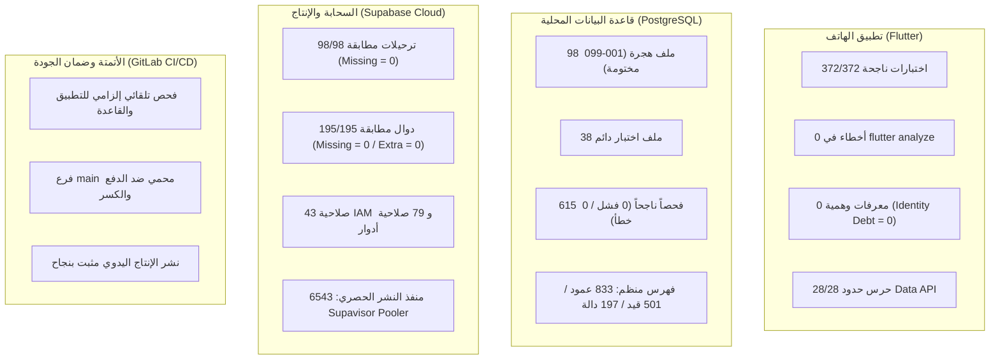

# تقرير إغلاق بوابة التدقيق والتثبيت (ق-120)

**التاريخ:** 2026-09-13  
**الحالة:** معتمد ونافذ بـ **ق-127**  
**المرجع الحاكم:** القرار ق-120 (2026-08-30) — *بوابة التدقيق والتثبيت قبل أي توسع وظيفي*  
**المشروع:** إدارة وتشغيل الآبار والري (`well-irrigation`)  

---

## 1. الملخص التنفيذي

في 2026-08-30، صدر القرار الحاكم **ق-120** لتجميد أي توسع وظيفي أو إضافة شاشات جديدة، وإيقاف الانتقال إلى شاشات العمل دون اتصال (`W2-02d`)، وفرض مرحلة تدقيق شاملة:
> **Inspection → Evaluation → Repair → Gap Closing → Regression Proof**

كان الهدف تطهير النظام من الفجوات الهيكلية والحرجة (انحراف حدود واجهات البيانات، الحسابات المالية غير المحمية، المعرفات الوهمية الصلبة، والنجاح الكاذب)، وتثبيت خط أساس حقيقي ومقاس لا يقبل التخمين.

اليوم، بعد **14 يوماً من العمل المكثف الممنهج** (إنجاز المراحل م-41A حتى م-41H، ثم م-42):
- **طابور التدقيق (Audit Queue):** أُغلقت جميع بنوده الـ 16 بنجاح تام وبأدلة واختبارات دائمية.
- **دين المعرفات والبيانات الوهمية:** انخفض من وضع كارثي إلى **صفر مطلق (0)**.
- **حدود واجهة البيانات (`api.*`):** حرس حدود آلي صارم بنسبة **28/28**.
- **الهجرات واختبارات القاعدة:** **98 هجرة** (001–099 مختومة)، **38 ملف اختبار دائم**، و **615 فحصاً ناجحاً (PASS=615, FAIL=0)**.
- **تطبيق الهاتف:** خلو تام من الملاحظات (`flutter analyze = 0`)، وشبكة اختبارات تضم **372 فحصاً ناجحاً**.
- **المطابقة السحابية (Production):** تطابق بنسبة **100%** لجميع الهجرات الـ 98 والدوال الـ 195 دون أي نقص أو زيادة، مع حماية كاملة لحسابات المشرفين والمشغلين.
- **البنية التحتية والمستودع:** انتقال آمن ومثبت إلى GitLab مع خط عمل آلي (CI/CD) ونشر سحابي محمي ومجرب.

---

## 2. مصفوفة إغلاق طابور التدقيق (Audit Queue Ledger)

يوثق الجدول التالي ما تم إنجازه تفصيلاً في كل فجوة كانت معلنة عند صدور ق-120:

| الرمز | موضوع الفجوة | ما وجده التدقيق عند البدء | ما تم تنفيذه وإثباته | حالة الإغلاق |
| :--- | :--- | :--- | :--- | :---: |
| **م-41A** | حدود RPC المالية | 7 استدعاءات مالية مباشرة عبر مخططات داخلية | توجيه كافة العمليات المالية حصرياً عبر `api.*` وإلزام عقود الخادم الصارمة | **مُغلقة ومُثبتة** ✅ |
| **م-41B1** | جرد الوقود الفعلي | نجاح كاذب عند فشل الخادم؛ خلط وحدات القياس | الربط بالعقد `api.record_physical_fuel_count` والتحويل الدقيق (لتر $\leftrightarrow$ مل) وإلغاء النجاح الوهمي | **مُغلقة ومُثبتة** ✅ |
| **م-41B2** | حدود إدارة الآبار | استدعاءات عشوائية خارج نطاق `api` | حصر كافة قراءات وتعديلات الآبار عبر عقود `api` المعتمدة | **مُغلقة ومُثبتة** ✅ |
| **م-41B3** | إدارة الفريق الزائفة | واجهة تنشئ أعضاء وهميين دون حسابات حقيقية | استئصال الواجهة الزائفة وإظهار الحالة الواقعية بصراحة دون ادعاء | **مُغلقة ومُثبتة** ✅ |
| **م-41C** | قراءة وسجل الجلسات | استعلامات جدولية مباشرة من العميل وتجميع أرقام | استبدالها بعقدي `api.get_session_history` و `api.get_session_detail` | **مُغلقة ومُثبتة** ✅ |
| **م-41D1** | صلاحيات إعداد البئر | ارتباك في صلاحيات إنشاء البئر (هجرة 091) | ضبط صلاحيات المالك والمشغل بدقة وفصل الأدوار | **مُغلقة ومُثبتة** ✅ |
| **م-41D2** | التقارير والمؤشرات | الشاشات تحسب المجاميع المالية محلياً وتخترع أرقاماً | بناء العقد الحاكم `api.get_reports_summary` (هجرة 092) وحظر الحساب في العميل | **مُغلقة ومُثبتة** ✅ |
| **م-41D3..5** | المعرفات الوهمية الصلبة | انتشار معرفات ثابتة (`well-1`, `tenant-1`, `active-user`...) | استئصالها بالكامل وتصفير الدين الهيكلي، وتفعيل حرس فحص آلي يمنع عودتها | **مُغلقة ومُثبتة** ✅ |
| **م-41D6..7** | تسعيرة البئر وسعر الساعة | أسعار ثابتة ومضاعفة ($\times 100$)؛ المشغل لا يرى السعر | ربط الشاشات بجدول تسعير البئر الفعلي (هجرة 093) وتمكين المشغل من قراءة السعر الساري | **مُغلقة ومُثبتة** ✅ |
| **م-41D8** | الهوية الحقيقية للجلسة | الجلسة لا تعرف من المشغل الحقيقي | ق-122: اعتماد جلسة الهوية الصريحة من الخادم والربط بالبئر النشط الفعلي | **مُغلقة ومُثبتة** ✅ |
| **م-41E** | تنشيط المشغل وإدارة الفريق | دور المشغل مستحيل الاستخدام (لا مسار لإنشاء حسابه) | ق-123/124 (هجرات 094 و 095): بناء مسار تنشيط متكامل، وعزل جلسة الشريك الجارية | **مُغلقة ومُثبتة** ✅ |
| **م-41F** | استعادة كلمة المرور | مسار الاستعادة معطل ولا توجد آلية إثبات | هجرة 096 ودالة الحافة `reset-password` مع إثبات بشري مسؤول | **مُغلقة ومُثبتة** ✅ |
| **عقد 097** | سندات الرصيد المقدم | حاجز القرار 420: لا مسار لتسديد الفاتورة برصيد مسبق | هجرة 097: نافذة تسديد حقيقية يختار فيها المستخدم السند ويتحقق الخادم بدقة | **مُغلقة ومُثبتة** ✅ |
| **عقد 098** | حدود اليوم والمنطقة الزمنية | تضارب أيام الجلسات ومناطق الخادم الزمنية | ق-125 (هجرة 098): تثبيت التوقيت اليمني وتحديد يوم الجلسة بيوم انتهائها رسمياً | **مُغلقة ومُثبتة** ✅ |
| **م-41H** | دليل المزارعين الحقيقي | دمج قائمتين محلياً، واحتساب الأرصدة في الواجهة | هجرة 099: عقد موحد `api.list_well_farmer_directory` مرتب من الخادم ومحمي | **مُغلقة ومُثبتة** ✅ |
| **م-42** | انتقال GitLab والنشر السحابي | تعليق GitHub وانقطاع خط النشر للإنتاج | ق-126: بناء مستودع محمي وخط CI/CD متكامل، ونشر واختبار هجرة 099 سحابياً | **مُغلقة ومُثبتة** ✅ |

---

## 3. خط الأساس الرقمي المثبت (The Proven Baseline)

الأرقام أدناه **مُقاسة ومُثبتة تشغيلياً** في جلسة 2026-09-13، وليست أرقاماً نظرية:

---

## 4. المبادئ الثابتة التي رسخها التدقيق (Core Invariants)

خلال مرحلة ق-120، تم تطبيق معايير هندسية صارمة تحولت إلى ثوابت غير قابلة للمساس:
1. **ق-78 / ق-79 (سطح البيانات المكشوف):** مخطط `api` هو السطح الوحيد المسموح للواجهة بالتخاطب معه. لا وصول مباشر لجداول `core` أو `operations` أو `finance`.
2. **ق-99 (نزاهة الحسابات المالية):** يُمنع منعاً باتاً احتساب الفلوس أو حصص الشركاء أو الرصيد المتبقي داخل كود الهاتف. الحساب حق حصري لمحرك قاعدة البيانات والعمليات المحاسبية المقفلة.
3. **ق-113 والثابت 699 (حظر النجاح الكاذب والفشل الكاذب):** أي فحص أو أداة مراقبة يجب أن تفشل صراحة عند غياب البيانات، ولا يجوز افتراض الصفر أو التظاهر بالنجاح في حالة عدم الاتصال ما لم يكن الحفظ المحلي مثبتاً.
4. **ختم الهجرات:** تم ختم الهجرات من 071 حتى 099 نهائياً، مع اشتراط وجود ملف فحص دائم في `supabase/tests` لكل هجرة جديدة قادمة بدءاً من الرقم 100.

---

## 5. القيود المعروفة والمتبقية (Known Boundaries & Next Horizons)

قبل اعتبار النظام جاهزاً للإطلاق التجاري الميداني الواسع، يوثق هذا التقرير الحدود المتبقية بوضوح وشفافية:
1. **الاختبار على أجهزة أندرويد حقيقية في الميدان (Field Device Acceptance):**
   كل ما أُنجز حتى الآن مثبت عبر الاختبارات الآلية ومحاكيات النظام؛ يتطلب المشروع جولة اختبار عملية على جهاز فعلي للتحقق من الأداء، الطابعات الحرارية عبر البلوتوث، وتناسق الخطوط وتكبير الشاشة.
2. **بوابة الرسائل النصية القصيرة (SMS Provider Gateway):**
   إرسال كلمات المرور المؤقتة والتحقق البشري يعمل حالياً عبر مسار المسؤول/المشرف المعتمد؛ والربط الآلي المباشر مؤجل لحين التعاقد مع مزود خدمة SMS محلي (ق-124).
3. **العمل دون اتصال والمزامنة (`W2-02d`):**
   كانت مؤجلة صراحة بموجب ق-120؛ وبإغلاق البوابة الحالية يصبح من الممكن دراستها وتصميمها على أسس نظيفة خالية من المعرفات الوهمية.

---

## 6. القرار المعتمد (Ruling Decision)

بناءً على اكتمال جميع متطلبات طابور التدقيق، وتطابق السحابة الكامل، وسلامة شبكة الاختبارات:

> **اعتُمد القرار ق-127 بإغلاق بوابة ق-120 رسمياً، وإعلان انتهاء مرحلة التدقيق والتثبيت (Audit & Gap Closing Gate)، والانتقال بالمشروع إلى مرحلة: "القبول الميداني وتجهيز الإطلاق التجريبي" (Device Acceptance & Pilot Readiness).**
